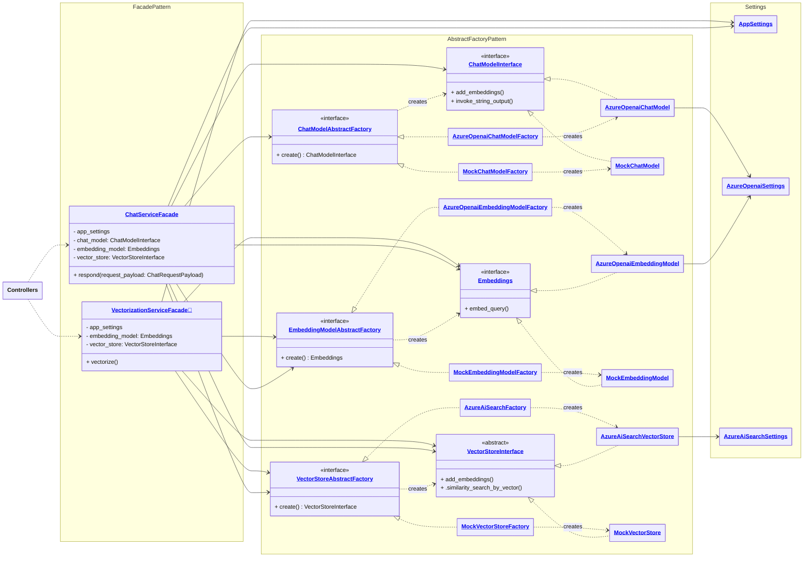

# HS's Wiki: Personal Website & Chatbot

🙋 Welcome to [hss.wiki](https://hss.wiki)'s source code! This open-source project is the backbone of my personal website, introducing my professional experiences with a mini RAG-based chatbot. Here you can find the source code for the entire stack—from frontend to backend and CI/CD.

  

## Key Features 🔑🎖️

- 🤖 **Digital Assistant**: A conversational chatbot that answers questions about me and my work, powered by state-of-the-art LLM and vector search technologies.

- 🧧 **Cost-Effective Deployment**: The project leverages Azure Static Web Apps and Azure AI Search free tiers, ensuring minimal hosting costs while providing high performance. The code and dependencies were carefully selected to fit into the 104 MB content limit of the Static Web Apps free plan.

- 📜 **Curated LLM Prompts**: Optimized prompts taking advantage of LLM's context caching mechanism, minimize response time and save costs, demonstrating efficiency in handling LLM interactions.

- 🏗️ **Modular and Scalable Architecture**: Implements design patterns such as Abstract Factory and Facade to allow seamless switching of chat models, embedding models, and vector stores simply by updating environment variables.

- 🛋️ **Flexible Development Environment**: The backend leverages frameworks like LangChain and Hugging Face models, with both local and cloud-based embedding models and vector stores, so that the cost can be further reduced by embedding documents and testing retrieval offline on a local machine.

## Backend Class Diagram 💻🏫📈

Note that the class names link to the source code in the repository when viewing this diagram on GitHub, while the pushpin emoji 📍 next to the class names link to the source code file when previewing this diagram on local machine, where the class name links won't work since they are GitHub URLs. Vice versa.

Fun fact: The above navigable class diagram is drafted by GPT-4o, given the codebase as context and some of my design pattern notes in Mermaid as examples.

## Technical Stack 🔨🪜

- 🕸️ **React**: Used for building the interactive UI.
  - [**masterPortfolio**](https://github.com/ashutosh1919/masterPortfolio): The open-source website template.
  - [**react-chat-window**](https://github.com/asliddinusmonov/popup-chat-react): Chat window component.
  - [**react-i18next**](https://github.com/i18next/react-i18next-gitbook/blob/f5f2f29be9f15e556dab72ea25d7b4466283c059/getting-started.md): Internationalization.
  - [**i18next-browser-languagedetector**](https://github.com/i18next/i18next-browser-languageDetector/blob/d2d58b9a21f028eb595a22afd598704254d5cb50/README.md): Browser language detection.
- 🐍 **Python**: The Python backend demonstrates robust design patterns and integrates modern LLM and vector search capabilities.
  - **Langchain**: For language model orchestration.
  - **Hugging Face**: For local embedding models.
  - **ChromaDB**: As a local vector store option.
- ☁️ **Azure Cloud Computing Services**:
  - **Azure Static Web Apps**: For hosting the website.
    - Note that `apiRuntime python:3.11` won't work even if it's [documented as available](https://learn.microsoft.com/en-us/azure/static-web-apps/languages-runtimes). It will fall back to 3.8. The latest available version of the Python runtime is 3.10.16 on Debian Bullseye according to Oryx build logs as of 2025-04-04.
  - **Azure Functions**: Serverless backend computing.
  - **Azure OpenAI**: Integration with advanced language models.
  - **Azure AI Search**: For scalable similarity searches.
  - **Azure Monitor**: For application performance monitoring and logging.

## Project Directory ⛑️📁

The project structure is modeled after the [official Azure Static Web Apps template repository](https://github.com/staticwebdev/vanilla-basic) and can be found in this [documentation](https://learn.microsoft.com/en-us/azure/static-web-apps/getting-started?tabs=react). The main folders include:

- `.devcontainer`: Configuration for development containers
- `.github`: CI/CD pipeline definitions and GitHub Actions workflows
- `.vscode`: VS Code workspace settings and launch configurations
- `api`: Azure Function Apps backend
  - `data`: Data assets for backend functionality
  - `env`: Environment configuration files
  - `src`: Source code for API endpoints and business logic
    - `components`: Modular components implementing core backend logic
      - `chat_models`: Handles integration with various chat models.
      - `embedding_models`: Manages embedding models for vectorization of text data.
      - `vector_stores`: Implements vector store logic for similarity search and retrieval.
    - `controllers`: Defines route handlers and orchestrates requests to services.
    - `services`: Contains business logic and service layer abstractions.
    - `settings`: Manages configuration and environment variables.
    - `utils`: Utility functions and helpers for common backend operations.
  - `tests`: Automated tests for the backend
  - `function_app.py`: Entry point for Azure Functions
- `docs`: Documentation including design documents and diagrams
- `src`: Frontend source code, including React components and assets

If you want to integrate a new chat model, embedding model, or vector store of your choice, simply add a new component that implements the corresponding interface defined in the `components` directory. For example, to add a new chat model, create a factory class that implements the `ChatModelAbstractFactory` interface and a model class that adheres to the `ChatModelInterface`. Once added, set the `chat_model` environment variable to the class name of the new chat model, and the system will automatically use it for chat interactions. This modular design ensures seamless integration and scalability without modifying the existing codebase.

🎉 Have a good time around!
